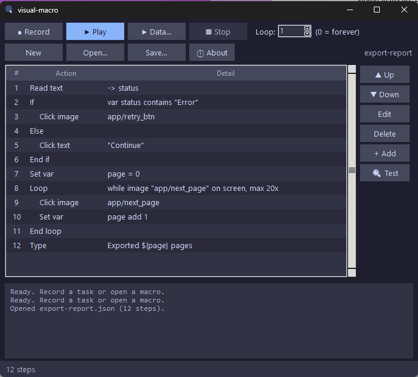
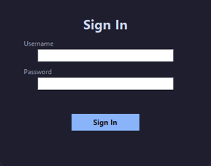
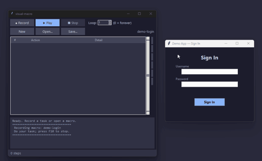
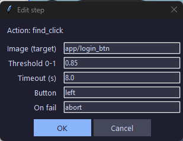
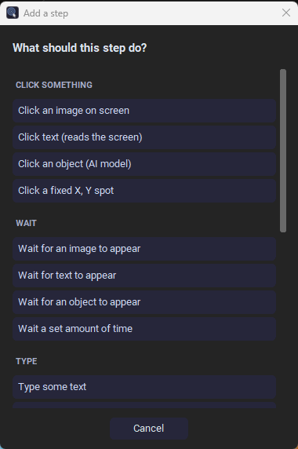
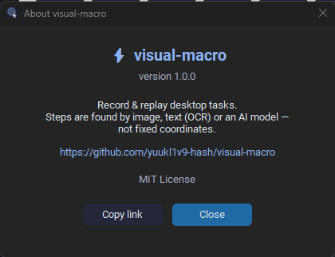

# visual-macro

[](https://github.com/yuukl1v9-hash/visual-macro)
[](https://github.com/yuukl1v9-hash/visual-macro/commits)
[](https://github.com/yuukl1v9-hash/visual-macro)
[](https://github.com/yuukl1v9-hash/visual-macro)
[](https://github.com/yuukl1v9-hash/visual-macro/stargazers)


[](LICENSE)

A visual automation tool: **see a target on screen → click/type → repeat.**
Like AutoHotkey and TinyTask, but the steps are anchored to *what things look
like*, not fixed `(x, y)` coordinates — so a macro keeps working when a window
moves or the layout shifts.

| | TinyTask | AutoHotkey | **visual-macro** |
|---|---|---|---|
| Setup | record | write code | record / point |
| Survives window move | ❌ | with effort | ✅ (image-anchored) |
| Logic (wait-for, loops, conditions) | ❌ | ✅ | ✅ (no code) |

> Built for desktop automation — installers, tedious UI workflows, testing your
> own apps. Not for sending input into online games (that's against their ToS).

## Contents

- [Screenshots](#screenshots)
- [Status](#status)
- [Setup](#setup)
- [Try it (30 seconds)](#try-it-30-seconds)
- [The app](#the-app)
- [Record a macro](#record-a-macro-the-easy-way)
- [How a macro works](#how-a-macro-works)
  - [Step actions](#step-actions)
  - [ML object detection](#ml-object-detection-buttons-that-change-appearance)
  - [Variables](#variables)
  - [Reusable sub-macros](#reusable-sub-macros-call)
  - [Loops](#loops-loop--end_loop--break--continue)
  - [Conditionals](#conditionals-if--else--end_if)
  - [Finding text (OCR)](#finding-text-ocr)
- [Layout](#layout)
- [Roadmap](#roadmap)
- [Safety notes](#safety-notes)
- [License](#license)

## Screenshots

<table>
<tr>
<td width="50%" align="center">
<br>
<sub><b>The app</b> — modern dark UI: sidebar, editable step list, live log.</sub>
</td>
<td width="50%" align="center">
<br>
<sub><b>Playback</b> — finds each field by sight and drives it, no fixed coordinates.</sub>
</td>
</tr>
<tr>
<td width="50%" align="center">
<br>
<sub><b>Recording</b> — steps and the capture log appear live as you act.</sub>
</td>
<td width="50%" align="center">
<br>
<sub><b>Step editor</b> — fields match the step type; no syntax to learn.</sub>
</td>
</tr>
<tr>
<td width="50%" align="center">
<br>
<sub><b>Add step</b> — a plain-English menu; no need to know the step names.</sub>
</td>
<td width="50%" align="center">
<br>
<sub><b>About</b> — every dialog matches the dark theme.</sub>
</td>
</tr>
</table>

## Status

**Feature-complete MVP** — core engine, recorder, and a desktop UI. Record a
task by doing it once, edit the steps in a list, and play it back with a loop
count, all without touching JSON or the command line.

```powershell
python ui/app.py
```

## Setup

**Easiest:** double-click **`run_ui.bat`**. On the first run it creates the
virtual environment and installs dependencies automatically, then launches the
app; every run after that just opens the app. (Requires Python already installed
with "Add to PATH" ticked.)

**Manual:**
```powershell
cd C:\Users\yuukl\visual-macro
python -m venv .venv
.\.venv\Scripts\Activate.ps1
pip install -r requirements.txt
```

**Standalone .exe (no Python for end users):** run **`build_exe.bat`** — it
bundles the app with PyInstaller into `dist\visual-macro\visual-macro.exe`. Zip
that folder and it runs on any Windows PC without Python installed. (OCR and the
ML detector are optional and not bundled by default — see the note the script
prints.)

## Try it (30 seconds)

1. Capture a button to look for — run this, then drag a box around **any**
   button on your screen and press ENTER:
   ```powershell
   python grab_anchor.py example/target_button
   ```
2. Run the example macro. It waits 2s, finds that button, clicks it, then types:
   ```powershell
   python main.py
   ```
3. **Press F12 anytime to hard-stop.** (Or slam the mouse into a screen corner.)

## The app

```powershell
python ui/app.py
```

- **● Record** — name it, then a **3-2-1 countdown** gives you time to switch to
  your target app (clicks during the countdown aren't recorded). The window
  minimizes and a floating badge shows the countdown, then **● Recording — press
  F10 to stop**, so you're never recording blind. Do your task, press **F10**.
- **▶ Play** — runs the macro. **Loop** sets how many times (0 = forever).
- **■ Stop** / **F12** — abort a run instantly.
- **Step list** — select a row, then **▲/▼** to reorder, **Edit** (or double-click)
  to change a field, **Delete**, or **+ Add** a step.
- **🔍 Test** — select a detection step and Test it: it searches the screen
  *without* clicking, flashes a box where it *would* click, and logs the
  confidence — so you can see and fix a bad match before you ever run the macro.
- **New / Open / Save** — macros are JSON files in `macros/`.

A **🌙 Dark / ☀ Light** toggle sits at the bottom of the sidebar; your theme
choice and the **window size/position** are remembered between launches. Hover
any button for a tooltip, and an empty macro shows a hint on what to do.
Keyboard shortcuts: **Ctrl+N/O/S** (new/open/save), **Del** (delete step),
**F5** (play), **F12** (stop). Unsaved edits are marked, and it asks before
discarding them on new/open/quit. **+ Add** opens a plain-English menu — no need
to know the internal step names:

<p align="center"></p>

Editing a step opens a small dialog whose fields match the step type — no syntax.
Fields that take a screen region have a **Pick ▢** button: drag a box on screen
instead of typing pixel numbers.

### Data-driven runs (▶ Data…)

Run a macro **once per row of a CSV**, with each column exposed as a `${variable}`
— batch/"mail-merge" automation. Click **▶ Data…**, pick a CSV, and confirm.

Given `people.csv`:

```csv
name,email
Alice,alice@example.com
Bob,bob@example.com
```

a macro whose steps `type ${name}` and `type ${email}` runs twice, filling
Alice's details, then Bob's. Great for filling a form from a spreadsheet,
renaming files from a list, or any repeat-with-different-values task. Variables
are re-seeded fresh each row (no leakage), and **F12** still stops everything.

### Global hotkeys (⌨ Hotkeys)

Bind a keyboard shortcut to a saved macro and fire it **from any app**, AHK-style
— the app doesn't need focus. Click **⌨ Hotkeys**, type a combo (e.g.
`ctrl+alt+1`), pick a macro file, **Add binding**. Bindings persist in
`hotkeys.json` and re-arm every launch. A background listener runs whenever the
app is open; pressing a bound key plays that macro (ignored if one's already
running). `F12` still aborts.

### Scheduling (🕑 Schedule)

Run a saved macro **daily at a set time** or **every N minutes**. Click
**🕑 Schedule**, pick a macro, choose **Daily** (`HH:MM`, 24-hour) or **Every**
(minutes), **Add schedule**. Schedules persist in `schedules.json` and fire while
the app is open (a due macro is skipped if one is already running).

> This is an in-app scheduler — the app must be running. To fire a macro when the
> app is closed, point **Windows Task Scheduler** at `python main.py macros\your.json`.

Prefer the command line? The recorder and player also run standalone — see below.

### Getting reliable clicks (avoiding the "wrong button")

Template matching clicks the single best match on screen, so two things cause
wrong clicks — and the app now guards both:

- **Ambiguous matches are refused.** If a look-alike scores nearly as high as
  the real target, the macro *won't* click; it logs `AMBIGUOUS …` and tells you
  to narrow it down. Fix it by **locking a region** (Edit → **Pick ▢**) so only
  the right area is searched, or by re-capturing a more distinctive anchor.
- **Weak matches are refused** by the threshold. Use **🔍 Test** to read the
  confidence, then raise the step's threshold (e.g. `0.90`) to reject near-misses.
- **Different DPI/resolution?** Turn on `multi_scale` in the step's args and it
  matches the anchor at several sizes. (The app is also DPI-aware, so clicks land
  correctly at 125%/150% display scaling.)
- **Theme/colour changed** (dark vs light mode)? Set `edges: true` in the step's
  args to match the button's *outline* instead of its pixels.

## Record a macro (the easy way)

```powershell
python recorder.py my-macro
```

Do your task by hand, then press **F10** to stop and save. The recorder watches
your mouse and keyboard and writes `macros/my-macro.json` + anchor PNGs in
`assets/my-macro/`. It captures:

- **clicks** → grabs a snapshot around the click → a `find_click` step (finds the
  button wherever it is on playback)
- **typing** → merged into one `type` step
- **ctrl/alt/win + key** → a `hotkey` step (e.g. `ctrl+s`)
- **enter / tab / esc / arrows** → a `hotkey` step
- **long pauses** → a `wait` step, preserving your pacing

Each action shows up live as it's captured, and the finished steps are ready to
play, reorder, or edit.

Then play it back:

```powershell
python main.py macros/my-macro.json
```

Recorded macros are just JSON — open the file and tweak any step, add a
`"repeat": 5`, raise a threshold, or delete a stray click.

## How a macro works

A macro is a plain JSON file in `macros/` plus a folder of anchor PNGs in
`assets/`. That's the whole format — portable, shareable, hand-editable.

```jsonc
{
  "name": "my macro",
  "repeat": 3,                       // run the whole list 3x (0 = forever)
  "region": null,                    // or [left, top, width, height] to limit search
  "steps": [
    { "action": "wait_for",  "target": "app/login_btn", "timeout": 10 },
    { "action": "find_click","target": "app/login_btn" },
    { "action": "type",      "target": "my-username" },
    { "action": "hotkey",    "args": { "keys": ["enter"] } },
    { "action": "wait",      "args": { "seconds": 1.5 } }
  ]
}
```

### Step actions

| action | what it does | key fields |
|---|---|---|
| `find_click` | find the anchor image, click its center | `target`, `threshold`, `timeout` |
| `wait_for` | block until the anchor appears (handles load times) | `target`, `timeout` |
| `find_text_click` | OCR the screen, click text (e.g. "Continue") | `target` (the text), `threshold`, `args: {region}` |
| `wait_for_text` | block until some text appears | `target`, `timeout` |
| `find_object_click` | ML-detect a *class* of element, click it | `target` (class label), `threshold`, `args: {model, region}` |
| `wait_for_object` | block until a class of element appears | `target`, `timeout` |
| `click` | click fixed coordinates (fallback) | `args: {x, y, button, clicks}` |
| `type` | type text | `target` = the text |
| `hotkey` | press a chord | `args: {keys: ["ctrl","s"]}` |
| `wait` | sleep | `args: {seconds}` |
| `if` / `else` / `end_if` | run steps only when an image/text is (or isn't) on screen | `args: {cond: {...}}` |
| `loop` / `end_loop` | repeat a block N times or while/until a condition holds | `args: {count, mode, cond}` |
| `break` / `continue` | exit / skip to next iteration of the enclosing loop | — |
| `call` | run another saved macro as a subroutine | `target` (macro name), `args: {repeat}` |
| `set` | assign a variable (or add/sub/mul/div a number) | `target` (var), `args: {op, value}` |
| `ask` | pause and prompt you for a value → variable | `target` (var), `args: {message, default}` |
| `read_text` | OCR a region and store the text in a variable | `target` (var), `args: {region}` |

`on_fail` per step: `"abort"` (default), `"skip"`, or `"retry"`.
`threshold` is match confidence 0–1 (default 0.80); raise it if it clicks the
wrong thing, lower it if it can't find a slightly-changed button.

### ML object detection (buttons that change appearance)

Template matching needs a near-pixel match; when a button's label, theme, or size
varies, use a trained detector instead. `find_object_click` / `wait_for_object`
run a YOLOv8-style ONNX model and act on a whole *class* of element:

```jsonc
{ "action": "find_object_click", "target": "button",
  "threshold": 0.50, "timeout": 10,
  "args": { "model": "buttons.onnx", "region": [0, 800, 1920, 280] } }
```

- `target` is a **class label** the model was trained on (or a numeric class
  index). `threshold` is the minimum detection confidence.
- `args.model` names a file in `models/`; leave blank to auto-pick the first
  `*.onnx` there. `args.region` restricts and speeds up the search.
- The model loads lazily on first use and is cached. If none is present, the step
  fails with a logged pointer to `models/README.md` rather than crashing.

Setup and how to get/train a model: see **[models/README.md](models/README.md)**.
Runtime needs only `pip install onnxruntime`; training a model needs
`ultralytics` (`train_detector.py` wraps it).

### Variables

Capture a value and use it later — a counter, an OCR'd number, a status string.
Variables are strings held for the run; reference one anywhere with `${name}`.

```jsonc
{ "action": "set", "target": "clicks", "args": { "op": "assign", "value": "0" } },
{ "action": "loop", "args": { "count": 0, "mode": "while",
    "cond": { "type": "var", "name": "clicks", "op": "lt", "value": "5" } } },
{ "action": "find_click", "target": "app/next" },
{ "action": "set", "target": "clicks", "args": { "op": "add", "value": "1" } },
{ "action": "end_loop" },

{ "action": "read_text", "target": "score", "args": { "region": [900,40,200,60] } },
{ "action": "type", "target": "Final score was ${score}" }
```

- **`set`** — `op: assign` stores a literal (with `${var}` expanded); `add`/`sub`/
  `mul`/`div` do arithmetic on a numeric variable (great for counters).
- **`read_text`** — OCRs a screen region and stores whatever text it reads into a
  variable. Needs the OCR extra (`rapidocr-onnxruntime`).
- **`${name}` substitution** works in `type` text, in detection targets (image
  name / OCR text / object class), and in `hotkey` keys — unset vars expand to "".
- **`var` conditions** — `if` and `loop` (while/until) accept a condition of
  `type: var` with `op` one of `eq / ne / contains / gt / lt / ge / le / set /
  empty`. In the editor, set the condition **Type** to `var` and fill the
  `[var]` name/op/value fields.
- Variables reset at the start of each run and **persist across** the toolbar's
  top-level Loop repeats — so a counter can accumulate over the whole run.

### Reusable sub-macros (call)

Factor a common sequence (log in, dismiss a dialog, save a file) into its own
macro and `call` it from others — like a function. Build `login.json` once, then:

```jsonc
{ "action": "call", "target": "login", "args": { "repeat": 1 } },
{ "action": "find_click", "target": "app/new_doc" },
{ "action": "call", "target": "save_and_close" }
```

- `target` is the macro's name (the `.json` filename, with or without extension).
  In the editor the **Macro name** field is a dropdown of your saved macros
  (still editable, so you can name one you haven't saved yet).
- `args.repeat` runs the sub-macro N times (default 1).
- A sub-macro uses **its own** search `region` if it set one, else the caller's.
  Its anchor images resolve from `assets/` as usual, so a called macro just works.
- **Isolation:** `break`/`continue` inside a sub-macro affect only *its* loops —
  they don't break the caller's loop (it's a subroutine boundary). A failure that
  aborts, or F12, still stops everything.
- **Recursion-safe:** a macro that (directly or indirectly) calls itself is
  detected and skipped, and call depth is capped at 20 — no infinite hangs.

### Loops (loop / end_loop / break / continue)

Repeat a block of steps, with a safety cap and/or a condition, and bail out early
when something happens:

```jsonc
{ "action": "loop", "args": {
    "count": 100,          // max iterations, 0 = unlimited (until break / F12)
    "mode": "while",       // "while" | "until" | "" (none)
    "cond": {              // required only when mode is while/until
      "type": "image", "target": "app/next_page",
      "threshold": 0.80, "timeout": 2.0 } } },
{ "action": "find_click", "target": "app/next_page" },
{ "action": "if", "args": { "cond": {
    "type": "text", "target": "Error" } } },
{ "action": "break" },        // stop looping if "Error" shows up
{ "action": "end_if" },
{ "action": "end_loop" }
```

- **`count`** caps iterations (0 = unlimited — rely on `break` or F12 to stop).
- **`mode`**: `while` runs while the condition is on screen; `until` runs until it
  appears; blank means count-only.
- **`break`** exits the nearest loop; **`continue`** skips to its next iteration.
  Put either inside an `if` block for a conditional break. They propagate up
  through nested `if`s to the enclosing loop.
- Loops nest inside loops and `if`s (and vice-versa); the step list indents to
  show it.

> A loop with `count: 0`, no condition, and no `break` runs forever — F12 is your
> stop. The macro's top-level **Loop** count (in the toolbar) is separate: it
> repeats the *entire* macro, whereas a `loop` block repeats just its own steps.

### Conditionals (if / else / end_if)

Run steps only when something is (or isn't) on screen — e.g. dismiss a popup only
if it appears, or take a different path when a login screen shows. Use three
marker steps that nest like AHK or batch files:

```jsonc
{ "action": "if", "args": { "cond": {
    "type": "image",          // or "text"
    "target": "app/popup_x",  // image name, or the text to look for
    "threshold": 0.80,        // match confidence / min OCR confidence
    "timeout": 2.0,           // seconds to wait for it before deciding
    "negate": false           // true = run the block when NOT found
} } },
{ "action": "find_click", "target": "app/popup_x" },   // runs only if the popup is there
{ "action": "else" },                                   // optional
{ "action": "wait", "args": { "seconds": 0.2 } },
{ "action": "end_if" }
```

In the app, add an **if** step (a dialog sets the condition), then **else** and
**end_if** from **+ Add**. The step list indents everything between them so the
nesting is visible; `if`s can be nested inside other `if`s. Stray or unbalanced
markers are logged and skipped rather than crashing the run.

### Finding text (OCR)

`find_text_click` and `wait_for_text` locate *text* instead of an image — handy
for buttons whose text is stable but whose position moves, or that you'd rather
not screenshot. They need RapidOCR (one-time install):

```powershell
pip install rapidocr-onnxruntime
```

The OCR model loads lazily the first time a text step runs (a second or two),
then stays warm. Full-screen OCR is comparatively slow, so for a tight loop set
an `args.region` of `[left, top, width, height]` to scan only where the text can
appear — in the editor that's the "Region l,t,w,h" field. Matching is
case-insensitive and fuzzy, so minor OCR slips still hit. `threshold` here is the
minimum OCR confidence (default 0.50).

## Layout

```
visual-macro/
├─ core/
│  ├─ capture.py    # screen grab (dxcam if present, else mss)
│  ├─ dpi.py        # per-monitor DPI awareness (correct clicks when scaled)
│  ├─ detector.py   # OpenCV template match + ambiguity/edge/multi-scale
│  ├─ ocr.py        # RapidOCR text match -> (found, center, confidence)
│  ├─ ml_detector.py# YOLOv8 ONNX object detector -> (found, center, confidence)
│  ├─ actuator.py   # mouse/keyboard via pynput (center-click, settle delay)
│  └─ engine.py     # runs a Macro: sense -> act -> verify -> next, F12-abortable
├─ macros/          # your macros as JSON
├─ assets/          # anchor PNGs, grouped per macro
├─ models/          # drop a YOLOv8 .onnx here for object detection
├─ train_detector.py# train + export your own model (needs ultralytics)
├─ run_ui.bat       # double-click launcher (sets up venv, runs the app)
├─ build_exe.bat    # bundle a standalone .exe with PyInstaller
├─ ui/app.py        # the desktop app: sidebar + step list (CustomTkinter)
├─ recorder.py      # record a task by doing it once (F10 to stop)
├─ grab_anchor.py   # capture an anchor by dragging a box (manual)
└─ main.py          # load a macro + F12 panic hotkey (CLI player)
```

## Roadmap

- [x] **1. Core engine** — detect → click → verify, JSON macros, F12 panic
- [x] **2. Recorder** — record a task by doing it once; auto-captures anchors
- [x] **3. UI** — toolbar (Record/Play/Loop) + reorderable, editable step list
- [x] **OCR text steps** — `find_text_click` / `wait_for_text` (RapidOCR)
- [x] **Conditionals** — `if` / `else` / `end_if` blocks (image or text conditions)
- [x] **ML object detector** — `find_object_click` / `wait_for_object` (YOLOv8 ONNX)
- [x] **Loops** — `loop` / `end_loop` with `break` / `continue` and while/until
- [x] **Sub-macros** — `call` another macro as a subroutine (recursion-safe)
- [x] **Variables** — `set` / `read_text`, `${var}` substitution, `var` conditions
- [x] **Reliability** — ambiguous/weak-match refusal, `multi_scale`, `edges`
      matching, DPI-awareness, and a **Test** button that previews a match
- [x] **Region picker** — drag a box to set a search region
- [x] **Dark theme** — restyled UI (and dark title bar)
- [x] **Packaging** — `build_exe.bat` → standalone Windows `.exe`

## Safety notes

- Test new macros with `repeat: 1` before looping.
- Keep the F12 listener in mind — it's your kill switch.
- A macro only acts when confidence clears the threshold; on a miss it retries
  then aborts rather than clicking blindly where the button "should" be.

## License

[MIT](LICENSE) © Yuuk
